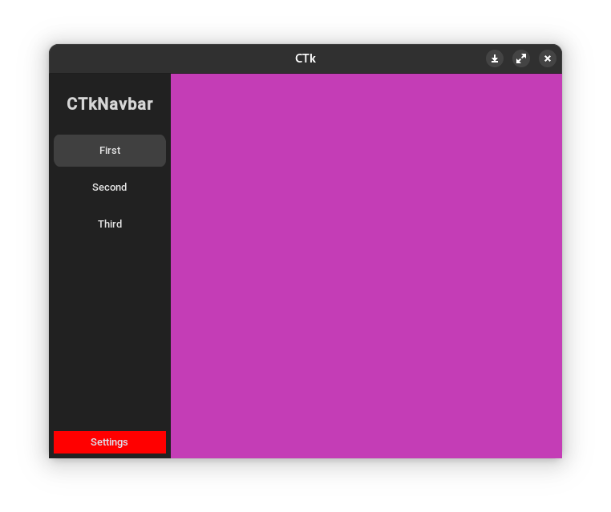
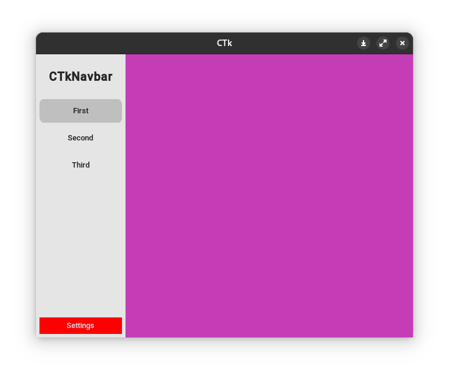
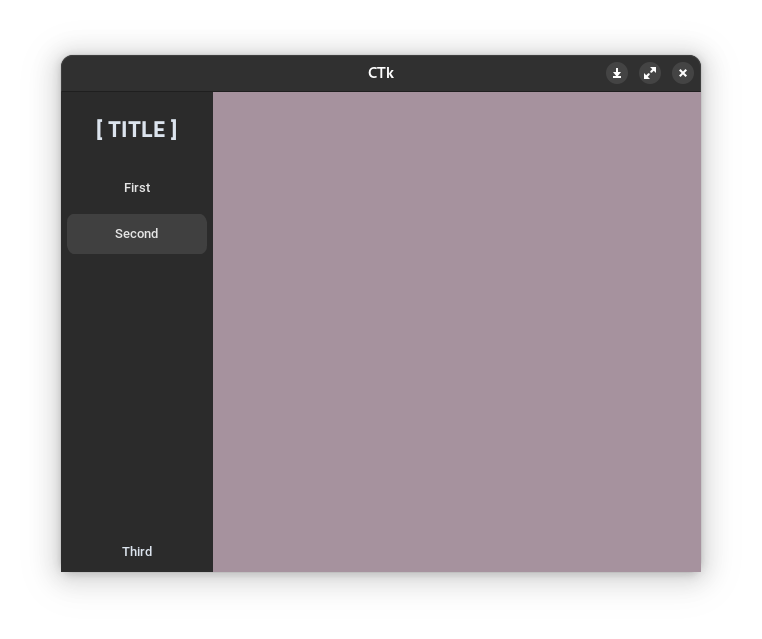

# CTkNavbar
**Simple navigation bar view for [customtkinter](https://github.com/TomSchimansky/CustomTkinter) library**

|                                        |                             |
|---------------------------------------------|---------------------------------------------|

example in the file [how_to_use.py](examples%2Fhow_to_use.py)
  
## How to install
``` bash
pip install https://github.com/nkeff/CTkNavbar/releases/download/v.0.1.0/ctknavbar-0.1.0-py3-none-any.whl
```
or 
1) copy `ctk_navbar.py` file in your project
2) You must have [customtkinter](https://github.com/TomSchimansky/CustomTkinter) library installed

## Usage

```python
import customtkinter

from ctknavbar import CTkNavbar

if __name__ == "__main__":

    root = customtkinter.CTk()
    root.geometry("640x480")
    root.grid_columnconfigure(0, weight=1)
    root.grid_rowconfigure(0, weight=1)

    nav = CTkNavbar(master=root,  label_text="[ TITLE ]", end_buttons_count=1)
    nav.add_page(button_text="First")
    nav.add_page(button_text="Second")

    custom_frame = customtkinter.CTkFrame(master=nav, fg_color="orange", corner_radius=100)
    custom_btn = customtkinter.CTkButton(master=nav.sidebar_frame, text="Third", fg_color="green")
    nav.add_page(btn=custom_btn, frame=custom_frame)

    nav.grid(row=0, column=0, sticky="nsew")

    root.mainloop()
```


Also, if there are a large number of frames, you can use the `CtkNavbar.render()` 
manual function to optimize the number of calls to the `CtkNavbar._render()` 
function and speed up your application
```python
from ctknavbar import CTkNavbar
import customtkinter

app = customtkinter.CTk() 

nav = CtkNavbar(master=app, auto_render=False)
nav.add_page(button_text="1")
nav.add_page(button_text="2")
nav.render() # call render function once
nav.grid(row=0, column=0, sticky="nsew")

nav.add_page(button_text="3")
# add many pages here
nav.add_page(button_text="42")
nav.render() # call render function once
```

